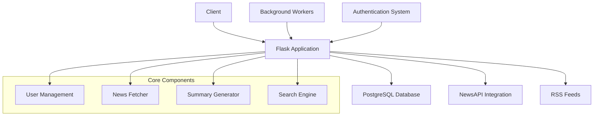

# Агрегатор новостей

## Быстрый старт с Docker:

```bash
docker-compose up --build
```
Приложение будет доступно по адресу `http://localhost:5000`

**Требуется обязательная регистрация** — для полного доступа необходимо зарегистрироваться или войти в систему как администратор (логин: admin, пароль: password123).

## Скриншоты:


## Архитектура:



## Основные функции:

### Интеллектуальная обработка новостей
- **Краткие изложения на основе ИИ** — автоматическое обобщение новостей с использованием алгоритма LSA
- **Фильтрация по темам** — интеллектуальная категоризация (политика, технологии, экономика, спорт, культура, наука)
- **Объединение нескольких источников** — NewsAPI + RSS-каналы крупных российских новостных изданий

### Персонализация пользователя
- ** Настраиваемые источники новостей ** - Выбираемые пользователем источники новостей
- **Персонализированная лента новостей ** - Контент, созданный искусственным интеллектом на основе предпочтений
- ** Система избранного ** - Добавляйте в закладки и сохраняйте важные статьи

### Расширенные функциональные возможности
- ** Поиск в реальном времени ** - Полнотекстовый поиск по всем статьям
- ** Автоматическое обновление ** - Обновление новостей каждые 2 часа
- **RESTful API ** - Конечные точки JSON для сводок новостей и данных

### Технические моменты
- **JWT-аутентификация** — защита пользовательских сессий
- **Фоновые рабочие процессы** — асинхронная обработка новостей
- **Адаптивный дизайн** — интерфейс, оптимизированный для мобильных устройств
- **Развертывание в Docker** — архитектура микросервисов в контейнерах

## Набор технологий
- **Бэкенд**: Flask, SQLAlchemy, PostgreSQL
- **Искусственный интеллект и машинное обучение**: NLTK, Sumy для обобщения текста
- **Фронтенд**: современный CSS3, ванильный JavaScript, адаптация для мобильных телефонов и планшетов
- **Инфраструктура**: Docker, Docker Compose
- **API**: NewsAPI, парсинг RSS
